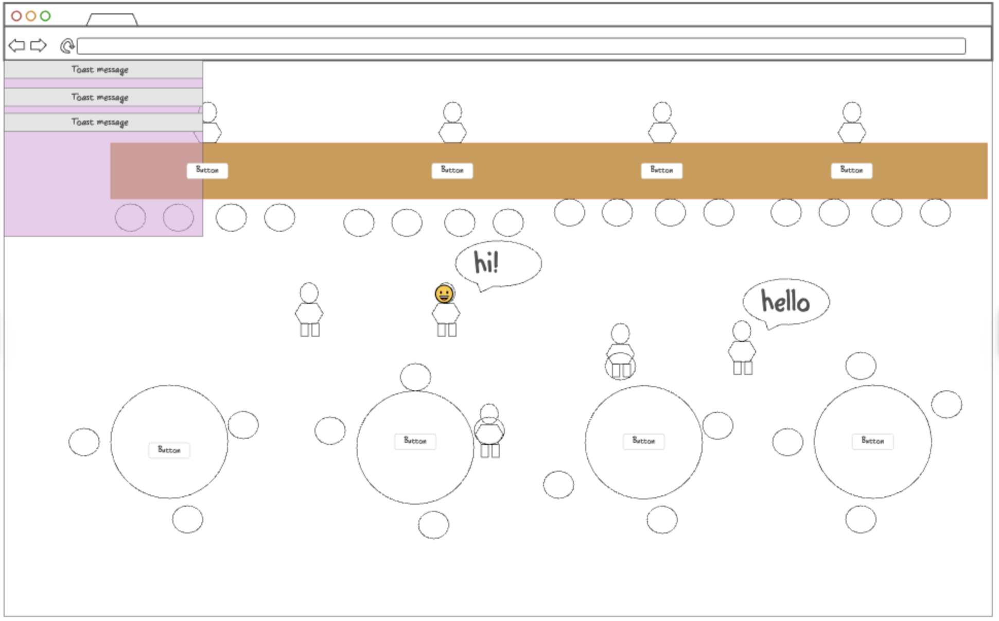
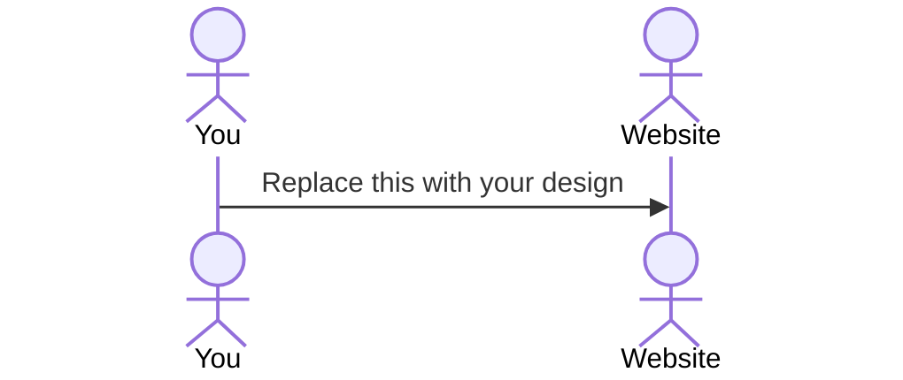

# Room

[My Notes](notes.md)

I am making a virtual chat room where you create a simple small character and can walk around and talk to others in the room. There will be objects you can interract with that others will be able to see. Thinking something like a post it board and buying others drinks. 

> [!NOTE]
>  This is a template for your startup application. You must modify this `README.md` file for each phase of your development. You only need to fill in the section for each deliverable when that deliverable is submitted in Canvas. Without completing the section for a deliverable, the TA will not know what to look for when grading your submission. Feel free to add additional information to each deliverable description, but make sure you at least have the list of rubric items and a description of what you did for each item.

> [!NOTE]
>  If you are not familiar with Markdown then you should review the [documentation](https://docs.github.com/en/get-started/writing-on-github/getting-started-with-writing-and-formatting-on-github/basic-writing-and-formatting-syntax) before continuing.

## 🚀 Specification Deliverable

> [!NOTE]
>  Fill in this sections as the submission artifact for this deliverable. You can refer to this [example](https://github.com/webprogramming260/startup-example/blob/main/README.md) for inspiration.

For this deliverable I did the following. I checked the box `[x]` and added a description for things I completed.

- [x] Proper use of Markdown
- [x] A concise and compelling elevator pitch
- [x] Description of key features
- [x] Description of how you will use each technology
- [x] One or more rough sketches of your application. Images must be embedded in this file using Markdown image references.

### Elevator pitch

Welcome to Room! Have you ever had a long day and just wanted to sit and unwind with friends but the thought of being in public sounds misreable? With Room you can do just that without leaving the comfort of your home. In Room you can emote and chat with friends in a interactive environment playful environment. 

### Design

Top Bar: User profile, virtual currency balance, and settings menu.

Main Area: Interactive café layout with movable avatars.

Chat Window: Display chat history with real-time bubbles above avatars.

Menu: A floating menu for purchasing virtual items.

### Key features

- Customizable Characters: Design your own avatar
- Interactive Space: walk around and interact with objects
- Real time chat: Talk to other users in real time via text chat bubbles.
- Expressive Emotes: Use a range of emotes like waving, and dancing.

### Technologies

I am going to use the required technologies in the following ways.

- **HTML** - Structure the hub layout with sections for seating areas, bar counters, and customizable avatars.
- **CSS** - Create a nice, chill aesthetic with quality colors, smooth animations, and responsive design for screen sizes.
- **React** - Build a dynamic single-page application with reusable components like the avatar editor, menu, and chat window. Ill also use React Router to manage navigation between spaces.
- **Service** - Call external APIs for random trivia questions or weather-based Room themes using the OpenWeather API
- **DB/Login** - Store user profiles, items, and chat logs in DB. Track virtual currency balances for purchasing items.
- **WebSocket** - Enable real-time messaging for chats and emote triggers. Broadcast special announcements like event updates or limited-time specials.

## 🚀 AWS deliverable

For this deliverable I did the following. I checked the box `[x]` and added a description for things I completed.

- [x] **Server deployed and accessible with custom domain name** - [My server link](https://startup.chatterpad.click/).

## 🚀 HTML deliverable

For this deliverable I did the following. I checked the box `[x]` and added a description for things I completed.

- [x] **HTML pages** - Made an html page for the home and login page that is serving as my index.html. I also made an html page for the room/hub that the user will hang out and interract with. 
- [x] **Proper HTML element usage** - Used headers, footers, main, div and nav to seperate elements and display information.
- [x] **Links** - Linked my github and there is easy page navigation through links
- [x] **Text** - added text place holders explaining what everything will be and where I will put it. 
- [x] **3rd party API placeholder** - I am going to use a weather api to change the way the room looks. 
- [x] **Images** - Image in there as a placeholder for the character design, ill add images as decorations to the room later.
- [x] **Login placeholder** - Added.
- [x] **DB data placeholder** - This will be seen with the gold counter and leaderboard as well as the current log of chats that is being stored.
- [x] **WebSocket placeholder** - The chat box will be in real time and with everyone in the room.

## 🚀 CSS deliverable

For this deliverable I did the following. I checked the box `[x]` and added a description for things I completed.

- [x] **Header, footer, and main content body** - Put github link in footers, added header of chatter pad, body content is the room and also the login box and some text. 
- [x] **Navigation elements** - The EXIT button on the room in the top left and the login button is on the index page.
- [x] **Responsive to window resizing** - Made the room window dynamic so it resizes but the inside content is fixed inside the container so it seems more like a real virtual room. The chat box and buttons stay in the corner for easy access. 
- [x] **Application elements** - Added the room and gold counter will probably add a player list. Added a bar and some tables with little cushion chairs. Might try and design more and add a bar tender. 
- [x] **Application text content** - Has username in corner of room and a gold counter will have a list of settings that come up when you click on settings later along with a chat box. Hoping to store chat logs. 
- [x] **Application images** - Added Photos on the walls of the room and also the floor and wall are repeated photos. Might let users change the pictures not sure if thats a good idea. 

## 🚀 React part 1: Routing deliverable

For this deliverable I did the following. I checked the box `[x]` and added a description for things I completed.

- [ ] **Bundled using Vite** - I did not complete this part of the deliverable.
- [ ] **Components** - I did not complete this part of the deliverable.
- [ ] **Router** - Routing between login and voting components.

## 🚀 React part 2: Reactivity

For this deliverable I did the following. I checked the box `[x]` and added a description for things I completed.

- [ ] **All functionality implemented or mocked out** - I did not complete this part of the deliverable.
- [ ] **Hooks** - I did not complete this part of the deliverable.

## 🚀 Service deliverable

For this deliverable I did the following. I checked the box `[x]` and added a description for things I completed.

- [ ] **Node.js/Express HTTP service** - I did not complete this part of the deliverable.
- [ ] **Static middleware for frontend** - I did not complete this part of the deliverable.
- [ ] **Calls to third party endpoints** - I did not complete this part of the deliverable.
- [ ] **Backend service endpoints** - I did not complete this part of the deliverable.
- [ ] **Frontend calls service endpoints** - I did not complete this part of the deliverable.

## 🚀 DB/Login deliverable

For this deliverable I did the following. I checked the box `[x]` and added a description for things I completed.

- [ ] **User registration** - I did not complete this part of the deliverable.
- [ ] **User login and logout** - I did not complete this part of the deliverable.
- [ ] **Stores data in MongoDB** - I did not complete this part of the deliverable.
- [ ] **Stores credentials in MongoDB** - I did not complete this part of the deliverable.
- [ ] **Restricts functionality based on authentication** - I did not complete this part of the deliverable.

## 🚀 WebSocket deliverable

For this deliverable I did the following. I checked the box `[x]` and added a description for things I completed.

- [ ] **Backend listens for WebSocket connection** - I did not complete this part of the deliverable.
- [ ] **Frontend makes WebSocket connection** - I did not complete this part of the deliverable.
- [ ] **Data sent over WebSocket connection** - I did not complete this part of the deliverable.
- [ ] **WebSocket data displayed** - I did not complete this part of the deliverable.
- [ ] **Application is fully functional** - I did not complete this part of the deliverable.
